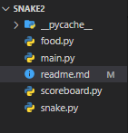

<h1> Snake Game <hr1> 

 

<h>

 Chuck Sommerville publicó en 1982 un juego llamado Snake Byte con la compañía Sirius Software. Pesaba únicamente 18 kb, el programador era Dan Stanfield y el músico Ray Elzey.

<hr2>¿Como Crearlo?<hr2>

 Hoy en dia tenemos un gran facilidad para repilicar este juegop gracias a la evolucion de la progrmacion con el paso de los años con un simple codigo podremos replicar este juego y en este documento explicaremos como lo podremos relizar en python.

<hr3>1 Paso <hr3>

El primer paso que relizaremos sera crear un carperta  la cual nombraremos "SNAKE" 

La cual abriremos en visual y crearemos los archivos que se visualizan en la imagen previa.

<hr4>Archivos<hr4>

*FOOD.PY

*MAIN.PY

*SCOREBOARD.PY

*SNAKE.PY

En cada uno de los archivos que hemos creado vamos a crear  el codigo para cada funcion del juego como lo es la comida, cuerpo, movimineto etc.

Acontinuacion encontraremos el codigo de cada funcion y encontraremos su explicacion y funcion en el juego

